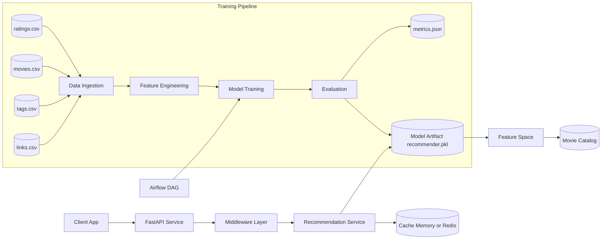
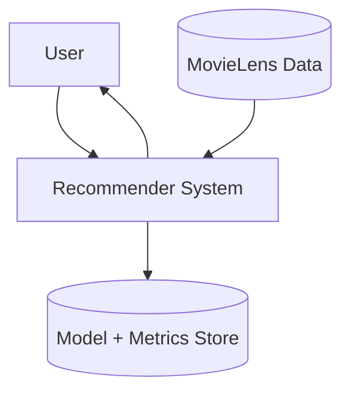
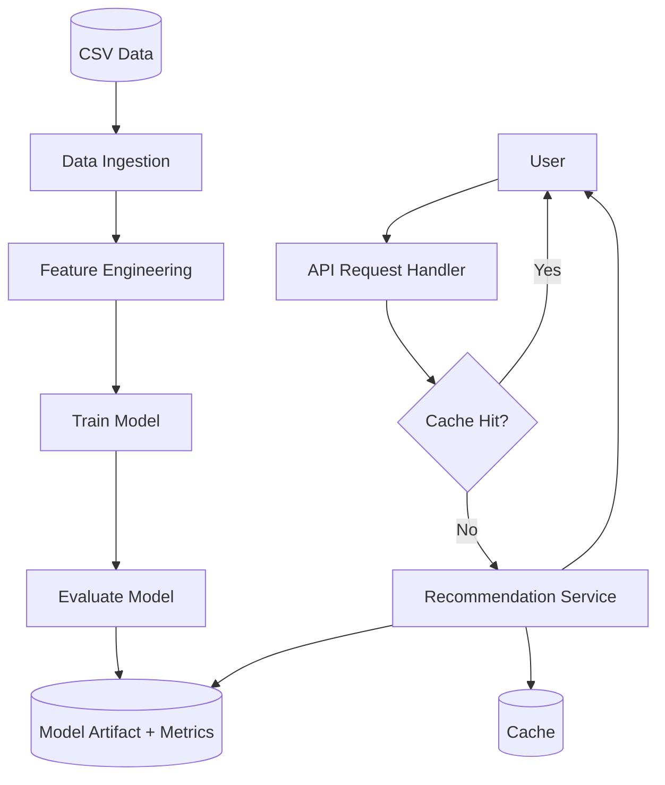
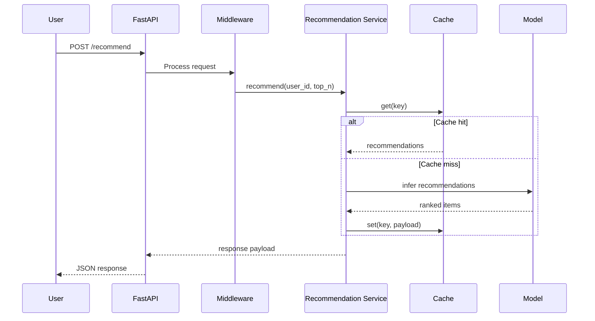
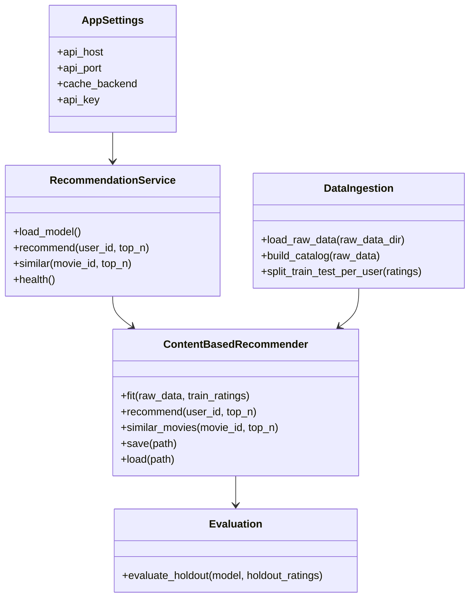

# Architecture

## System Architecture

```mermaid
flowchart LR
    U[Client App] --> API[FastAPI Service]
    API --> MW[Middleware Layer]
    MW --> SVC[Recommendation Service]
    SVC --> C[(Cache Memory or Redis)]
    SVC --> M[(Model Artifact recommender.pkl)]
    M --> FE[Feature Space]
    FE --> CAT[(Movie Catalog)]

    subgraph Training Pipeline
      R[(ratings.csv)] --> ING[Data Ingestion]
      MV[(movies.csv)] --> ING
      TG[(tags.csv)] --> ING
      LK[(links.csv)] --> ING
      ING --> ENG[Feature Engineering]
      ENG --> TR[Model Training]
      TR --> EV[Evaluation]
      EV --> M
      EV --> MET[(metrics.json)]
    end

    AF[Airflow DAG] --> TR
```

## Data Flow Diagram Level 0

```mermaid
flowchart TB
    User --> P0[Recommender System]
    P0 --> User
    DataSource[(MovieLens Data)] --> P0
    P0 --> ModelStore[(Model + Metrics Store)]
```

## Data Flow Diagram Level 1

```mermaid
flowchart TB
    DS[(CSV Data)] --> P1[Data Ingestion]
    P1 --> P2[Feature Engineering]
    P2 --> P3[Train Model]
    P3 --> P4[Evaluate Model]
    P4 --> MS[(Model Artifact + Metrics)]

    User --> P5[API Request Handler]
    P5 --> CH{Cache Hit?}
    CH -- Yes --> User
    CH -- No --> P6[Recommendation Service]
    P6 --> MS
    P6 --> CH2[(Cache)]
    P6 --> User
```

## Sequence Diagram

```mermaid
sequenceDiagram
    participant U as User
    participant API as FastAPI
    participant MW as Middleware
    participant S as Recommendation Service
    participant C as Cache
    participant M as Model

    U->>API: POST /recommend
    API->>MW: Process request
    MW->>S: recommend(user_id, top_n)
    S->>C: get(key)
    alt Cache hit
        C-->>S: recommendations
    else Cache miss
        S->>M: infer recommendations
        M-->>S: ranked items
        S->>C: set(key, payload)
    end
    S-->>API: response payload
    API-->>U: JSON response
```

## Component Diagram

```mermaid
classDiagram
    class AppSettings {
      +api_host
      +api_port
      +cache_backend
      +api_key
    }

    class RecommendationService {
      +load_model()
      +recommend(user_id, top_n)
      +similar(movie_id, top_n)
      +health()
    }

    class ContentBasedRecommender {
      +fit(raw_data, train_ratings)
      +recommend(user_id, top_n)
      +similar_movies(movie_id, top_n)
      +save(path)
      +load(path)
    }

    class DataIngestion {
      +load_raw_data(raw_data_dir)
      +build_catalog(raw_data)
      +split_train_test_per_user(ratings)
    }

    class Evaluation {
      +evaluate_holdout(model, holdout_ratings)
    }

    AppSettings --> RecommendationService
    RecommendationService --> ContentBasedRecommender
    DataIngestion --> ContentBasedRecommender
    ContentBasedRecommender --> Evaluation
```
